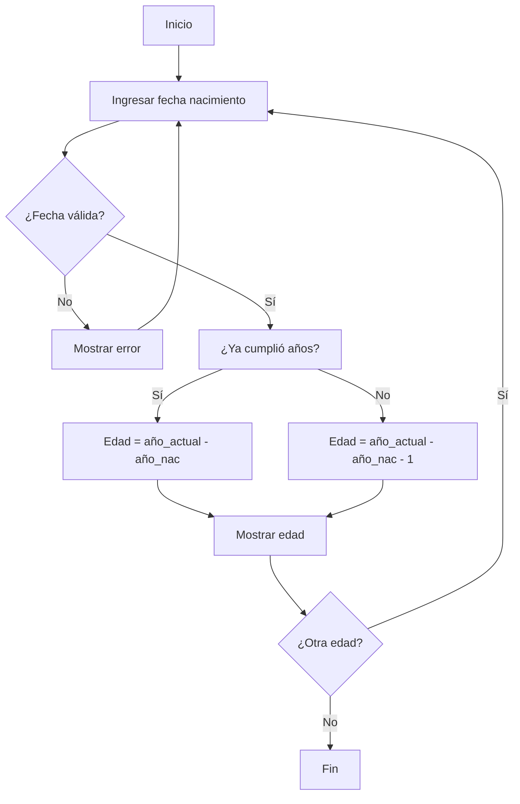

# 📘 Guía Didáctica de Programación  
**Autor:** Siniestro  
**Nivel:** Principiante → Intermedio  
**Destinatarios:** Maestros y alumnos  
**Lenguaje base:** Python  

---

## 📑 Índice de Contenidos
- [🧠 Parte 1 – Principios y Fundamentos Universales](#-parte-1--principios-y-fundamentos-universales)
- [💻 Parte 2 – Fundamentos Básicos (La Sintaxis Mental)](#-parte-2--fundamentos-básicos-la-sintaxis-mental)
- [🧩 Parte 3 – Principios de Buen Diseño (Filosofía del Código Limpio)](#-parte-3--principios-de-buen-diseño-filosofía-del-código-limpio)
- [🏗️ Parte 4 – Pensamiento Computacional (Plan de Clase)](#-parte-4--pensamiento-computacional-plan-de-clase)
- [🐍 Parte 5 – Introducción al Ecosistema Python](#-parte-5--introducción-al-ecosistema-python)
- [🎓 Parte 6 – Guía de Enseñanza Paso a Paso](#-parte-6--guía-de-enseñanza-paso-a-paso)
- [🔢 Parte 7 – Ejercicios Progresivos](#-parte-7--ejercicios-progresivos)
- [📊 Parte 8 – Proyecto Guiado: Calculadora de Edad](#-parte-8--proyecto-guiado-calculadora-de-edad)
- [👨‍🏫 Parte 9 – Material Didáctico (Maestros y Alumnos)](#-parte-9--material-didáctico-maestros-y-alumnos)

---

## 🧠 Parte 1 – Principios y Fundamentos Universales
1. **Abstracción** – ignorar detalles irrelevantes  
2. **Descomposición** – dividir problemas complejos  
3. **Composición** – construir sistemas desde componentes simples  
4. **Encapsulación** – ocultar implementación tras interfaces estables  
5. **Algoritmos y estructuras de datos** – estrategias computacionales fundamentales  
6. **Gestión de estado** – controlar mutabilidad y efectos secundarios  
7. **Complejidad computacional** – analizar tiempo/espacio (Big-O)  
8. **Paradigmas** – imperativo, declarativo, funcional, orientado a objetos  
9. **SOLID** – principios de diseño orientado a objetos  
10. **YAGNI, KISS, DRY** – filosofías de simplicidad y mantenibilidad  

---

## 💻 Parte 2 – Fundamentos Básicos (La Sintaxis Mental)

### Variables y Constantes
```python
nombre = "Ana"      # variable
PI = 3.1416         # constante (convención: mayúsculas)
```

### Tipos de Datos
| Tipo     | Ejemplo Python | Operaciones permitidas |
|----------|----------------|------------------------|
| int      | `edad = 18`    | `+ - * / // % **`      |
| float    | `altura = 1.75`| `+ - * /`**            |
| str      | `"hola"`       | `+ * .upper() .lower()`|
| bool     | `True / False` | `and or not`           |

### Estructuras de Control
```python
# Condicional
if edad >= 18:
    print("Mayor")
else:
    print("Menor")

# Bucle
for i in range(5):
    print(i)
```

### Funciones
```python
def calcular_area(base, altura):
    """Calcula área de rectángulo"""
    return base * altura
```

### Estructuras de Datos
```python
lista = [1, 2, 3]                    # ordenada, mutable
diccionario = {"clave": "valor"}     # clave-valor, mutable
```

### Entrada/Salida
```python
nombre = input("Nombre: ")
print(f"Hola {nombre}")
```

---

## 🧩 Parte 3 – Principios de Buen Diseño (Filosofía del Código Limpio)

| Principio | Significado | Ejemplo práctico |
|-----------|-------------|------------------|
| **DRY**   | No te repitas | Extraer función común |
| **KISS**  | Mantenlo simple | Una función = una tarea |
| **Legibilidad** | Nombres descriptivos | `total_usuarios` vs `tu` |
| **Modularidad** | Piezas pequeñas | Archivos por responsabilidad |
| **Abstracción** | Ocultar complejidad | `calcular_impuesto()` sin ver fórmula |

### Pilares POO (resumen)
- **Encapsulación** – agrupar datos y métodos  
- **Herencia** – reutilizar código entre clases  
- **Polimorfismo** – mismos mensajes, comportamientos distintos  

---

## 🏗️ Parte 4 – Pensamiento Computacional (Plan de Clase)

### Módulo 1 – Conceptos antes del código (2-3 clases)
| Concepto | Analogía | Actividad |
|----------|----------|-----------|
| Variable | Etiqueta en caja | `nombre = "Juan"` vs caja con nombre |
| Condicional | Decidir con paraguas | `si llueve → llevar paraguas` |
| Bucle | Lavar platos | `mientras haya platos sucios → lavar` |
| Función | Receta de cocina | `hacer_sandwich()` |

### Módulo 2 – Traducción a Python (visual)
| Concepto universal | Python | JavaScript | C++ |
|--------------------|--------|------------|-----|
| Asignación | `x = 5` | `let x = 5` | `int x = 5;` |
| Condicional | `if x>0:` | `if (x>0) {` | `if (x>0) {` |
| Bucle | `for i in range(5):` | `for(let i=0;i<5;i++)` | `for(int i=0;i<5;i++)` |

### Módulo 3 – Mentalidades de Software
1. **Descomposición** – "¿Cómo comer un elefante? Por partes"  
2. **Debugging mental** – encontrar dónde se rompe un proceso  
3. **Abstracción** – diseñar control remoto con solo 3 botones esenciales  

---

## 🐍 Parte 5 – Introducción al Ecosistema Python

### Pirámide de Lenguajes
```
NIVEL BAJO (cercano al hardware)
├── C, C++, Rust → SO, drivers, embebidos
├── Java, C#, Go → apps empresariales
├── PYTHON, JS, Ruby → prototipado, scripting, data
└── SQL, HTML/CSS, R → dominios específicos
```

### Fortalezas Python
- Sintaxis legible  
- No requiere compilación  
- Gran ecosistema (data, web, automatización)  

### Debilidades Python
- No apto para sistemas en tiempo real crítico  
- No móvil nativo ni videojuegos AAA  

### Comparativa rápida
| Aspecto | Python | C |
|---------|--------|---|
| Velocidad desarrollo | ⭐⭐⭐⭐⭐ | ⭐⭐ |
| Performance ejecución | ⭐⭐ | ⭐⭐⭐⭐⭐ |
| Facilidad aprendizaje | ⭐⭐⭐⭐⭐ | ⭐⭐ |

---

## 🎓 Parte 6 – Guía de Enseñanza Paso a Paso

### Semana 1 – Conceptos básicos
```python
print("¡Bienvenidos!")
nombre = "Ana"
edad = 20
print(f"Hola {nombre}, tienes {edad} años")
```

### Semana 2 – Control de flujo
```python
if edad >= 18:
    print("Mayor")
else:
    print("Menor")

for i in range(5):
    print(i)
```

### Entornos recomendados
- **Google Colab** (cero instalación)  
- **IDLE** (incluido con Python)  
- **Replit** (online colaborativo)  

---

## 🔢 Parte 7 – Ejercicios Progresivos

### Ejercicio 1 – Calculadora simple
```python
num1 = float(input("Primer número: "))
num2 = float(input("Segundo número: "))
print(f"Suma: {num1 + num2}")
```

### Ejercicio 2 – Adivina el número
```python
import random
secreto = random.randint(1, 10)
intento = int(input("Adivina (1-10): "))
if intento == secreto:
    print("¡Correcto!")
else:
    print(f"Fallaste. Era {secreto}")
```

---

## 📊 Parte 8 – Proyecto Guiado: Calculadora de Edad

### Diagrama de Flujo (Mermaid)


### Código Profesional (SOLID + DRY + caché)
```python
from abc import ABC, abstractmethod
from datetime import datetime, date
from typing import Optional, Dict, Any

class AgeCalculatorStrategy(ABC):
    @abstractmethod
    def calculate(self, birth_date: date, current_date: date) -> int: ...

class ExactAgeCalculator(AgeCalculatorStrategy):
    def calculate(self, birth_date: date, current_date: date) -> int:
        base = current_date.year - birth_date.year
        if (current_date.month, current_date.day) < (birth_date.month, birth_date.day):
            return base - 1
        return base

class AgeCalculator:
    def __init__(self, strategy: AgeCalculatorStrategy = None):
        self._strategy = strategy or ExactAgeCalculator()
        self._cache: Dict[str, int] = {}

    def calculate_age(self, birth_date_str: str) -> Dict[str, Any]:
        if birth_date_str in self._cache:
            return {"age": self._cache[birth_date_str], "cached": True}
        try:
            birth = datetime.strptime(birth_date_str, "%Y-%m-%d").date()
            age = self._strategy.calculate(birth, date.today())
            self._cache[birth_date_str] = age
            return {"age": age, "cached": False}
        except ValueError:
            return {"error": "Fecha inválida"}

# Uso rápido
calc = AgeCalculator()
print(calc.calculate_age("1990-03-15"))
```

### Versión Principiantes (paso a paso comentado)
Ver [Parte 9 – Sección 9.8](#sección-98--código-paso-a-paso-para-alumnos)

---

## 👨‍🏫 Parte 9 – Material Didáctico (Maestros y Alumnos)

### 9.1 Guía Rápida para el Docente
- **Duración sugerida:** 4-6 semanas (2 h/semana)  
- **Evaluación:** proyecto final explicado en español antes de mostrar código  
- **Metodología:** concepto → analogía → problema manual → código Python → discusión  

### 9.2 Rúbrica de Evaluación (por sección)
| Sección | Concepto Dominado | Código Funciona | Comprende el Porqué |
|---------|-------------------|-----------------|---------------------|
| 1-3     | Import, clases, constructor | ✅ | Explica `self` |
| 4-5     | Validación, cálculo fecha | ✅ | Justifica try/except |
| 6-8     | Presentación, historial | ✅ | Usa enumerate |
| 9-12    | Orquestación, main | ✅ | Explica `__name__` |

### 9.3 Analogías por Concepto
| Concepto | Analogía | Frase para recordar |
|----------|----------|---------------------|
| Variable | Etiqueta en caja | "Nombre en la caja, no la caja" |
| Función | Receta de cocina | "Entrada, proceso, salida" |
| Clase | Molde de galletas | "Un molde, muchas galletas" |
| Try/Except | Prueba de ropa | "Si no entra, prueba otra talla" |

### 9.4 Preguntas Guía (discusión en clase)
1. ¿Por qué Instagram usa Python en backend y no C?  
2. ¿Por qué un sistema de frenos de auto NO usaría Python?  
3. ¿Qué ventajas tiene Python para científicos de datos?  
4. ¿En qué casos preferirías C sobre Python?

### 9.5 Actividades de Refuerzo
- **Clase "CalculadoraSimple"** con suma, resta, multiplica, divide  
- **Validador de emails** (formato básico)  
- **Inventario de librería** con listas y diccionarios  
- **Juego "Adivina el número"** con contador de intentos  

### 9.6 Checklist para el Estudiante
Antes de entregar el proyecto:
- [ ] Mi programa ejecuta sin errores  
- [ ] Calcula edades correctamente (incluye años bisiestos)  
- [ ] El historial se muestra ordenado  
- [ ] El menú maneja opciones inválidas  
- [ ] Puedo explicar cada función en español  

### 9.7 Errores Comunes y Soluciones
| Error | Mensaje Python | Solución rápida |
|-------|----------------|-----------------|
| Olvidar `self` | `NameError: historial_calculos not defined` | Agregar `self.` |
| Formato fecha | `ValueError: time data 'hola' does not match` | Usar try/except |
| Indentación | `IndentationError` | Tabular con 4 espacios |

### 9.8 Sección 9.8 – Código Paso a Paso para Alumnos
```python
"""
🐍 CALCULADORA DE EDAD - VERSIÓN ESTUDIANTE
Instrucciones: escribe el código JUSTO debajo de cada comentario "TU CÓDIGO AQUÍ"
"""

# 1️⃣ Importar herramientas
# TU CÓDIGO AQUÍ
from datetime import datetime, date

# 2️⃣ Crear la clase
class CalculadoraEdad:
    # 3️⃣ Constructor
    def __init__(self):
        self.historial_calculos = []
        self.contador_calculos = 0
        print("✅ Calculadora lista")

    # 4️⃣ Validar fecha
    def validar_fecha(self, fecha_texto):
        try:
            fecha_convertida = datetime.strptime(fecha_texto, "%Y-%m-%d").date()
            if fecha_convertida > date.today():
                print("❌ Fecha futura")
                return None
            return fecha_convertida
        except ValueError:
            print("❌ Formato incorrecto")
            return None

    # 5️⃣ Calcular edad exacta
    def calcular_edad_exacta(self, fecha_nacimiento):
        hoy = date.today()
        edad_base = hoy.year - fecha_nacimiento.year
        if (hoy.month, hoy.day) < (fecha_nacimiento.month, fecha_nacimiento.day):
            return edad_base - 1
        return edad_base

    # 6️⃣ Mostrar resultado
    def mostrar_resultado(self, fecha_nacimiento, edad_calculada):
        print("\n" + "="*50)
        print("🎉 RESULTADO")
        print(f"📅 Naciste: {fecha_nacimiento}")
        print(f"🎂 Edad: {edad_calculada} años")
        print("="*50)

    # 7️⃣ Guardar en historial
    def guardar_en_historial(self, fecha_texto, edad_calculada):
        calculo = {
            'fecha_ingresada': fecha_texto,
            'edad_calculada': edad_calculada,
            'fecha_calculo': datetime.now().strftime("%Y-%m-%d %H:%M:%S")
        }
        self.historial_calculos.append(calculo)
        self.contador_calculos += 1

    # 8️⃣ Mostrar historial
    def mostrar_historial(self):
        if not self.historial_calculos:
            print("📝 Historial vacío")
            return
        for n, c in enumerate(self.historial_calculos, 1):
            print(f"{n}. {c['fecha_ingresada']} → {c['edad_calculada']} años")

    # 9️⃣ Función principal
    def calcular_edad(self, fecha_texto):
        fecha_validada = self.validar_fecha(fecha_texto)
        if not fecha_validada:
            return False
        edad = self.calcular_edad_exacta(fecha_validada)
        self.mostrar_resultado(fecha_validada, edad)
        self.guardar_en_historial(fecha_texto, edad)
        return True

# 🔟 Funciones auxiliares
def mostrar_bienvenida():
    print("🧮 BIENVENIDO")
    print("Formato: AAAA-MM-DD")

def obtener_opcion():
    while True:
        print("\n1. Calcular  2. Historial  3. Salir")
        op = input("Elige (1-3): ").strip()
        if op in ['1', '2', '3']:
            return op
        print("❌ Opción inválida")

# 🔄 Programa principal
def main():
    mostrar_bienvenida()
    calc = CalculadoraEdad()
    while True:
        op = obtener_opcion()
        if op == '1':
            fecha = input("Fecha nacimiento: ").strip()
            calc.calcular_edad(fecha)
        elif op == '2':
            calc.mostrar_historial()
        elif op == '3':
            print(f"👋 Hasta pronto. Calculaste {calc.contador_calculos} edades")
            break

if __name__ == "__main__":
    main()
```

---

## 🎉 Cierre
¡Felicitaciones!  
Dominar estos fundamentos te permitirá aprender **cualquier lenguaje** en el futuro: la lógica es universal; la sintaxis, solo detalle.

> "Programar no es escribir código, es pensar antes de escribirlo."

---

## 📚 Exportar a PDF - Guía Completa

### 10.1 Opciones para Convertir a Libro PDF

#### Opción A: Usando Markdown a PDF (Recomendado)
```bash
# Instalar herramientas necesarias
npm install -g markdown-pdf
# o
pip install markdown2pdf

# Convertir el archivo
markdown-pdf guia_programacion.md -o guia_programacion.pdf
```

#### Opción B: Usando Pandoc (Profesional)
```bash
# Instalar Pandoc
# Ubuntu/Debian: sudo apt-get install pandoc
# macOS: brew install pandoc
# Windows: descargar desde pandoc.org

# Convertir a PDF con formato profesional
pandoc guia_programacion.md -o guia_programacion.pdf \
  --pdf-engine=xelatex \
  --toc \
  --toc-depth=3 \
  --highlight-style=github \
  -V geometry:margin=1in \
  -V fontsize=12pt \
  -V documentclass=article \
  -V colorlinks=true \
  -V linkcolor=blue \
  -V urlcolor=blue \
  -V toccolor=blue
```

#### Opción C: Usando Typora (Visual)
1. Abrir el archivo en Typora
2. Archivo → Exportar → PDF
3. Configurar márgenes y encabezados
4. Exportar

### 10.2 Configuración Profesional para PDF

#### Metadatos para el PDF
```yaml
---
title: "Guía Didáctica de Programación"
author: "Siniestro"
date: "$(date +%Y-%m-%d)"
subject: "Programación y Educación"
keywords: [Python, programación, educación, principiantes]
lang: es
geometry:
  - margin=1in
fontsize: 12pt
documentclass: article
colorlinks: true
linkcolor: blue
urlcolor: blue
toc: true
toc-depth: 3
numbersections: true
---
```

#### Comando Pandoc Completo
```bash
pandoc guia_programacion.md \
  --metadata-file=metadata.yaml \
  -o guia_programacion.pdf \
  --pdf-engine=xelatex \
  --highlight-style=github \
  --table-of-contents \
  --toc-depth=3 \
  --number-sections \
  -V geometry:a4paper \
  -V geometry:margin=1.5cm \
  -V fontsize=11pt \
  -V mainfont="DejaVu Sans" \
  -V monofont="DejaVu Sans Mono" \
  -V colorlinks=true \
  -V linkcolor=blue \
  -V urlcolor=blue \
  -V toccolor=blue
```

### 10.3 Plantilla CSS para Estilo Profesional

#### Estilo para Typora/Material
```css
/* Estilo para impresión PDF */
@media print {
  body {
    font-family: 'DejaVu Sans', sans-serif;
    font-size: 12pt;
    line-height: 1.6;
    margin: 2cm;
  }
  
  h1, h2, h3, h4, h5, h6 {
    page-break-after: avoid;
    color: #2c3e50;
  }
  
  code {
    font-family: 'DejaVu Sans Mono', monospace;
    background-color: #f8f9fa;
    padding: 2px 4px;
    border-radius: 3px;
  }
  
  pre {
    background-color: #f8f9fa;
    padding: 1em;
    border-radius: 5px;
    overflow-x: auto;
    page-break-inside: avoid;
  }
  
  table {
    border-collapse: collapse;
    width: 100%;
    margin: 1em 0;
  }
  
  th, td {
    border: 1px solid #ddd;
    padding: 8px;
    text-align: left;
  }
  
  th {
    background-color: #f2f2f2;
    font-weight: bold;
  }
  
  .page-break {
    page-break-before: always;
  }
}
```

### 10.4 Estructura del Libro PDF

#### Portada Automática
```markdown
---
title: "Guía Didáctica de Programación"
subtitle: "De Principiante a Intermedio con Python"
author: "Siniestro"
date: "$(date +%Y)"
publisher: "Educación Tecnológica"
version: "1.0"
---

# Portada


# Guía Didáctica de Programación

## De Principiante a Intermedio con Python

**Autor:** Siniestro  
**Nivel:** Principiante → Intermedio  
**Destinatarios:** Maestros y alumnos  
**Lenguaje base:** Python  

---

*Versión 1.0*  
*$(date +%Y)*
```

### 10.5 Script Automático para Generar PDF

#### Script Bash (Linux/macOS)
```bash
#!/bin/bash
# generar_pdf.sh

echo "🚀 Generando PDF profesional..."

# Crear directorio de salida
mkdir -p output

# Generar metadatos
cat > metadata.yaml << EOF
title: "Guía Didáctica de Programación"
author: "Siniestro"
date: "$(date +%Y-%m-%d)"
subject: "Programación y Educación"
keywords: [Python, programación, educación, principiantes]
lang: es
geometry:
  - margin=1in
fontsize: 12pt
documentclass: article
colorlinks: true
linkcolor: blue
urlcolor: blue
toc: true
toc-depth: 3
numbersections: true
EOF

# Convertir a PDF
pandoc guia_programacion.md \
  --metadata-file=metadata.yaml \
  -o output/guia_programacion.pdf \
  --pdf-engine=xelatex \
  --highlight-style=github \
  --table-of-contents \
  --toc-depth=3 \
  --number-sections \
  -V geometry:a4paper \
  -V geometry:margin=1.5cm \
  -V fontsize=11pt

echo "✅ PDF generado en output/guia_programacion.pdf"

# Limpiar
rm metadata.yaml
```

#### Script Python (Multiplataforma)
```python
#!/usr/bin/env python3
# generar_pdf.py

import os
import subprocess
import sys
from datetime import datetime

def generar_pdf():
    """Genera PDF profesional desde markdown"""
    
    # Verificar dependencias
    try:
        subprocess.run(['pandoc', '--version'], 
                      capture_output=True, check=True)
    except (subprocess.CalledProcessError, FileNotFoundError):
        print("❌ Error: Pandoc no está instalado")
        print("Instala Pandoc desde https://pandoc.org/")
        return False
    
    # Crear directorio de salida
    os.makedirs('output', exist_ok=True)
    
    # Metadatos
    metadata = f"""
title: "Guía Didáctica de Programación"
author: "Siniestro"
date: "{datetime.now().strftime('%Y-%m-%d')}"
subject: "Programación y Educación"
keywords: [Python, programación, educación, principiantes]
lang: es
geometry:
  - margin=1in
fontsize: 12pt
documentclass: article
colorlinks: true
linkcolor: blue
urlcolor: blue
toc: true
toc-depth: 3
numbersections: true
"""
    
    # Guardar metadatos
    with open('metadata.yaml', 'w', encoding='utf-8') as f:
        f.write(metadata)
    
    # Comando Pandoc
    cmd = [
        'pandoc', 'guia_programacion.md',
        '--metadata-file=metadata.yaml',
        '-o', 'output/guia_programacion.pdf',
        '--pdf-engine=xelatex',
        '--highlight-style=github',
        '--table-of-contents',
        '--toc-depth=3',
        '--number-sections',
        '-V', 'geometry:a4paper',
        '-V', 'geometry:margin=1.5cm',
        '-V', 'fontsize=11pt'
    ]
    
    try:
        subprocess.run(cmd, check=True)
        print("✅ PDF generado en output/guia_programacion.pdf")
        return True
    except subprocess.CalledProcessError as e:
        print(f"❌ Error generando PDF: {e}")
        return False
    finally:
        # Limpiar
        if os.path.exists('metadata.yaml'):
            os.remove('metadata.yaml')

if __name__ == "__main__":
    generar_pdf()
```

### 10.6 Verificación de Calidad del PDF

#### Checklist de Calidad
- [ ] Portada profesional con título y autor
- [ ] Índice automático con páginas correctas
- [ ] Numeración de páginas
- [ ] Encabezados y pies de página
- [ ] Código con sintaxis resaltada
- [ ] Tablas bien formateadas
- [ ] Imágenes (si las hay) con buena resolución
- [ ] Márgenes consistentes
- [ ] Fuente legible (11-12pt)
- [ ] Saltos de página lógicos

#### Comando para verificar PDF
```bash
# Verificar estructura del PDF
pdfinfo output/guia_programacion.pdf

# Verificar páginas
pdftotext output/guia_programacion.pdf - | head -20

# Contar páginas
pdfinfo output/guia_programacion.pdf | grep Pages
```

### 10.7 Distribución del Libro

#### Opciones de Distribución
1. **GitHub Releases** - Para versiones controladas
2. **Google Drive** - Para compartir con estudiantes
3. **Sitio web personal** - Para descarga directa
4. **Plataformas educativas** - Integración con LMS

#### Nomenclatura de Archivos
```
guia_programacion_v1.0.pdf
guia_programacion_v1.0_estudiante.pdf
guia_programacion_v1.0_maestro.pdf
guia_programacion_v1.0_completa.pdf
```

---

## 🎯 Resumen de Exportación

### Comando Rápido (Copia y Pega)
```bash
# Una línea para generar PDF profesional
pandoc guia_programacion.md -o guia_programacion.pdf --pdf-engine=xelatex --toc --highlight-style=github -V geometry:margin=1in -V fontsize=12pt
```

### Herramientas Recomendadas
1. **Pandoc** - La mejor opción para calidad profesional
2. **Typora** - La más fácil para usuarios no técnicos
3. **Markdown PDF** - Buena para automatización
4. **Online converters** - Para pruebas rápidas

### Formatos Adicionales
- **EPUB**: Para lectores electrónicos
- **DOCX**: Para edición en Word
- **HTML**: Para web
- **LaTeX**: Para publicaciones académicas

> "Un buen libro técnico no solo enseña, también inspira."
